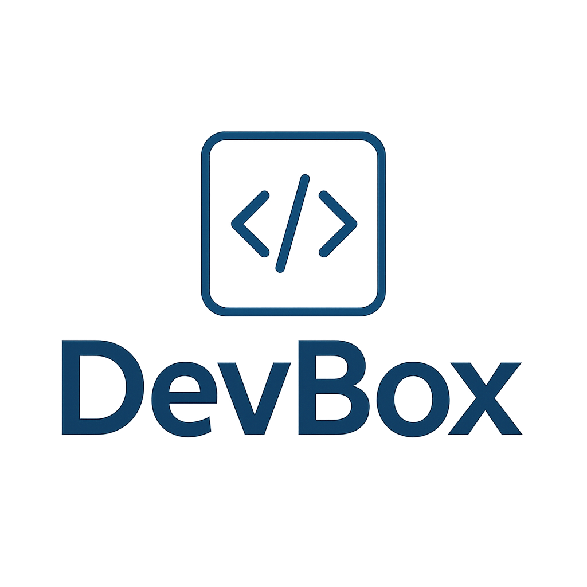
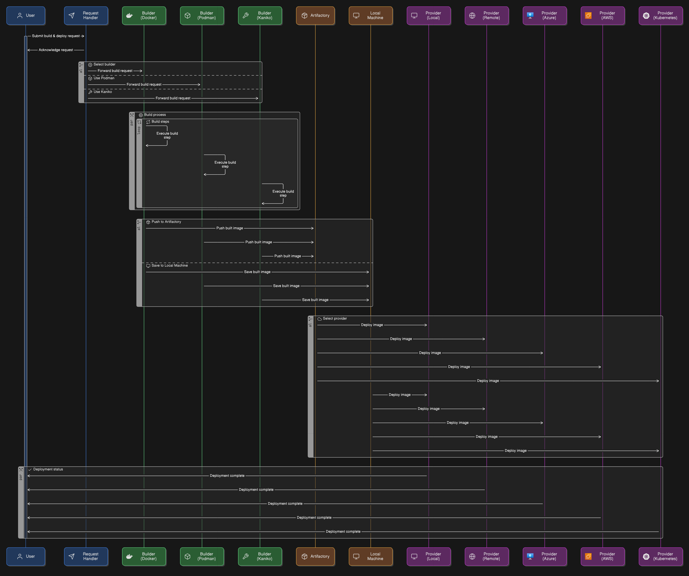

<div style="text-align: center;">
  
</div>

# Backend Service

## Project Overview

This is a Rust-based backend API service for DevBox built using the Axum web framework.

## What is DevBox?

Devbox (written in Rust) is similar to devcontainer but devbox can be deployed on cloud as well.

## API Endpoints

- `/devbox/create`: Create new container (Currently swagger does not mention all it's features).
- `/devbox/list`: List containers from DB.
- `/devbox/logs/{id}`: Get detailed logs for a container.
- `/devbox/{id}?action=start|stop|delete`: Start/Stop/Delete container.
- `/artifactories/`: Add, Remove, Modify and List artifactories.
- `/providers/`: Modify, List providers. 
- `/builders/`: Need to add endpoints for this.
- `/config/edit`: API routes for configuration management for anonymous user
- `/config/provider/docker|azure|aws/edit`: Endpoint to configure specific provider.
- `/ws/docker/{id}`: Websocket endpoint to get interactive shell with container.
- `/api-docs/openapi.json`: OpenAPI JSON specification for the API
- `/swagger`: Interactive Swagger UI for API exploration

## Running Locally

The backend server runs on `http://127.0.0.1:8000` by default and can be change by setting BINDING_ADDRESS env.

```bash
RUST_LOG=debug cargo run
```

Ensure you have Rust, docker daemon installed and dependencies resolved via Cargo.

### CORS Policy

The server allows Cross-Origin Resource Sharing (CORS) for origins like `http://127.0.0.1:3000`, typically used for local frontend development and can be change by setting ALLOWED_ORIGIN env.

## Logging

The backend uses the tracing crate for structured logging. Logs are output to the console.
Logs for building containers are also stored in separate file.

## Project Structure Example

The `example/` directory inside example branch demonstrates the expected project structure for DevBox:

### Required Structure

A DevBox-compatible project should include:

1. **`.devbox/` folder** - Contains configuration files:

   - `devbox.json` - Main configuration file with project settings:
     ```json
     {
       "name": "project-name",
       "image": "base-image:latest",
       "build": {
         "dockerfile": "Dockerfile",
         "context": "."
       },
       "features": {
         "feature-name": {
           "option": "value"
         }
       }
     }
     ```

2. **`.devbox/features/` folder** (optional) - Contains custom DevBox features:

   - Each feature in its own subfolder: `.devbox/features/{feature-name}/`
   - `devcontainer-feature.json` - Feature metadata and configuration
   - `install.sh` - Installation script for the feature
   - Features are based on devcontainer projects but modified for DevBox

3. **Base files**:
   - `Dockerfile` - Base container definition (if using custom build)
   - Application files (`.py`, `.js`, etc.)

### Example Configuration Fields

- **name**: Unique identifier for the DevBox container
- **image**: Base Docker image to use
- **build**: Docker build configuration (dockerfile path and context)
- **features**: HashMap of features to install with their configurations

### Features System

Features are modular components that can be added to DevBox containers and are just modified features from devcontainer project (https://github.com/devcontainers/features):

- Located in `.devbox/features/{feature-name}/` directories
- Each feature includes metadata in `devcontainer-feature.json`
- Installation scripts in `install.sh` (Bash/PowerShell)
- Features support configuration through JSON options
- Based on devcontainer feature specification but adapted for DevBox
- Example features included in the project demonstrate common development tools

### Configuration

Projects can be configured through:

- `.devbox/devbox.json` - Main project configuration
- Feature-specific settings within the devbox.json
- Provider configurations (Docker, AWS, Azure) via API endpoints
- Environment variables and custom scripts

### Example Project Layout

```
project-root/
├── .devbox/
│   ├── devbox.json
│   └── features/
│       ├── feature-name-1/
│       │   ├── devcontainer-feature.json
│       │   └── install.sh
│       └── feature-name-2/
│           ├── devcontainer-feature.json
│           └── install.sh
├── Dockerfile (optional)
├── myfile.py (example application file)
└── dummy_project/ (optional project subdirectory)
```

## Flow


<div style="text-align: center;">
  
</div>

## Notes

- Background tasks update container statuses every 5 seconds asynchronously.
- API documentation is accessible via the `/swagger` endpoint for ease of testing and exploration.
